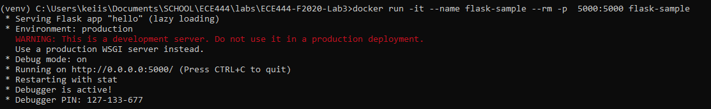
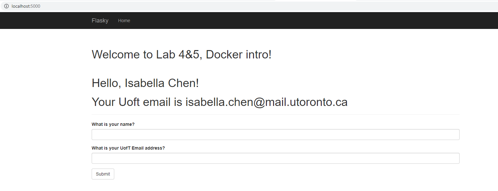
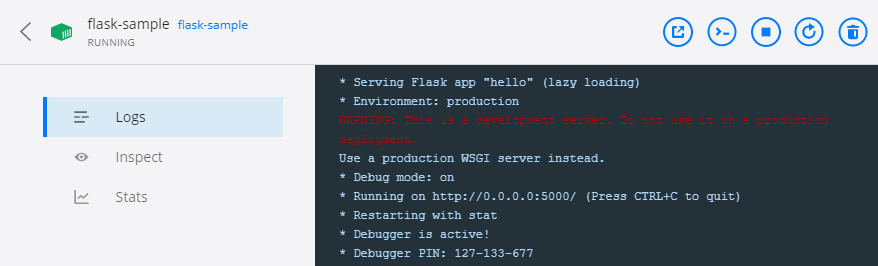

# Isabella Chen
this repo is a clone of https://github.com/miguelgrinberg/flasky

Deliverable 2: How to build and start the system

NOTE: To set up the docker environment, see this link https://docs.docker.com/get-started/

The location of Dockerfile is under the main folder ECE444-F2020-LAB3. This file will also use requirements.txt under the same folder to install necessary packages.

1) To use the Dockerfile to build the image, run the command `docker build -t flask-sample:latest .`

2) To start the system (run the container), run the command `docker run -it --name flask-sample --rm -p  5000:5000 flask-sample`
3) The application will be at localhost:5000

Screenshot of docker run command:

Screenshot of Browser:

Screenshot of docker image:

Deliverable 3: Briefly summarize the differences between Docker and Virtual Machine

Virtual machines (VMs) are emulations of computer systems and allow the user to run many computer systems on one hardware. Each VM uses a full copy of an operating system with a full copy of virtual hardware. So, an issue is evident where VMs can use up a lot of system resources such as RAM and CPU. However, VMs also have uses, such as its processes being able to be fully isolated, which leads to security benefits.

Examples of VMs: VMware vSphere, VirtualBox, Xen, Hyper-V, KVM

Docker is a utility that can create, ship and run containers. The benefits of docker is mainly from its containers that only virtualize the operating system (OS) instead of the entire computer. Also, the containers share the host OS. In this way, the containers are very light (take very little space compared to VMs) and are very fast to start up.

The comparison comes down to this table:
VMs | Docker's containers |
--- | --- |
Heavyweight | Lightweight 
Each VM runs its own OS | All containers share the host OS
Hardware-level virtualization | OS virtualization
Startup takes minutes | Startup takes miliseconds
Allocates more memory | Requires less memory
Fully isolated -> more secure | Precess-level isolation -> less secure