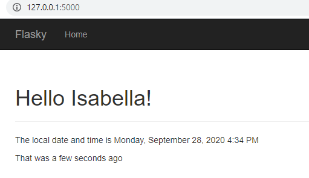
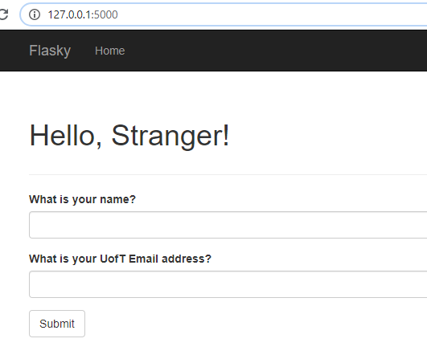
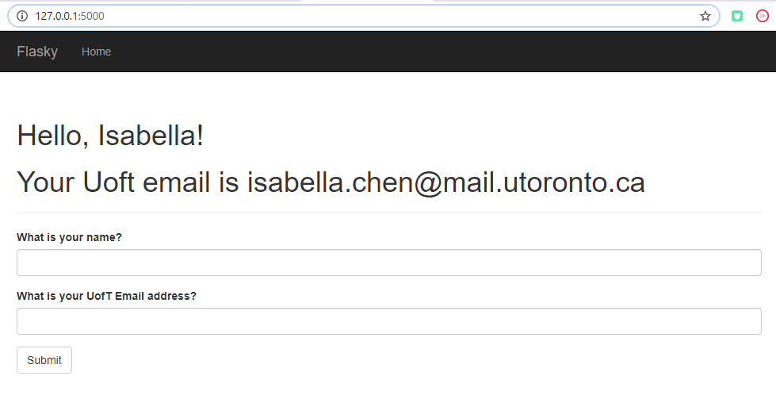
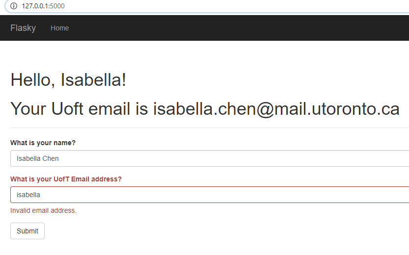
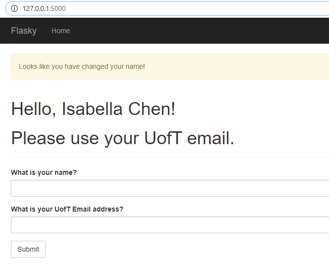

# Isabella Chen
this repo is a clone of https://github.com/miguelgrinberg/flasky

Activity 1: Replay and modify example in Chapter 3, corresponding commit: [9f48e3ef5680d44676bdbfb40443d018fa889dd0](https://github.com/isabellachen3988/ECE444-F2020-Lab3/commit/9f48e3ef5680d44676bdbfb40443d018fa889dd0)

Activity 2: Replay and modify example in Chapter 4, corresponding commit: [5af6a550174868d99f34d98335c06bd487ad9795](https://github.com/isabellachen3988/ECE444-F2020-Lab3/commit/5af6a550174868d99f34d98335c06bd487ad9795)

Activity 3: Briefly summarize the difference between SQL or NoSQL database

SQL databases are databases that prioritize structured data and consistency.
SQL databases are usually table based. They also have their own structured query language (SQL). These databases are fit for complex query intensive environments, but not for hierarchical data storage. Essentially, they are good when data validity is important and when support for dynamic queries is needed.

Examples of SQL databases: MySQL, Oracle, PostgreSQL, and Microsoft SQL server.

NoSQL databases are databases that relax these consistency requirements and prioritizes performance.
NoSQL databases can be document-based, key-value pairs, or graph databases. NoSQL databases have no declarative query language, therefore, they not a good fit for complex queries. However, these databases are good with hierarchical data store as they support the key-value pair method. Essentially, they are good when fast data over correct data is needed and when changing requirements require scaling.

Examples of NoSQL databases: MongoDB, BigTable, RavenDB Cassandra, HBase, Neo4j and CouchDB.
